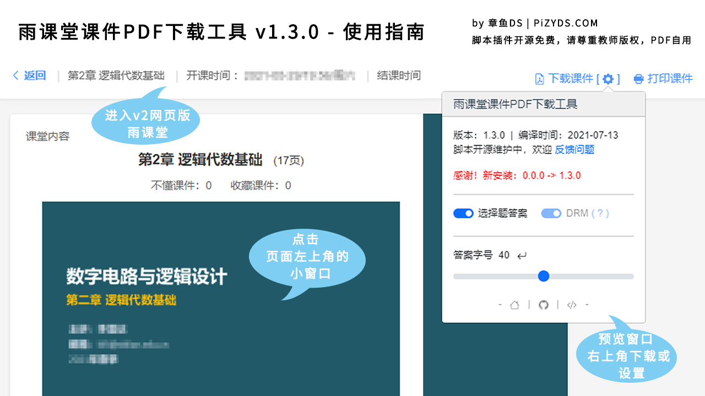

# 雨课堂课件PDF下载工具
**在雨课堂页面自动生成PDF版本课件提供下载**

## 注意 / Attention
这次推送到 Greasy Fork 的代码进行了 webpack 无压缩打包，所有源代码都可以在 [Github](https://github.com/PillarsZhang/Rain-Classroom-PDF-Direct-Download) 上找到！

The code pushed to Greasy Fork this time is packaged by webpack without compression. All the source code can be found on [Github](https://github.com/PillarsZhang/Rain-Classroom-PDF-Direct-Download)!

## 简介
雨课堂虽然有原生的打印功能，但是存在设置页面、拉伸图像、打印PDF等各种麻烦。于是乎自己给雨课堂加了个按钮，该脚本能够自动生成课件的PDF版本，只需要点击一下~

## 安装与反馈
- 安装链接：[https://greasyfork.org/scripts/424050](https://greasyfork.org/scripts/424050)
- 反馈主页：[https://www.pizyds.com/rain-classroom-pdf-direct-download](https://www.pizyds.com/rain-classroom-pdf-direct-download)
- Github：[https://github.com/PillarsZhang/Rain-Classroom-PDF-Direct-Download](https://github.com/PillarsZhang/Rain-Classroom-PDF-Direct-Download)

## 使用说明

适配了 [雨课堂网页版 v2](https://www.yuketang.cn/v2/web)，关键更新如下

- *1.0.6* 版本修改了链接匹配，理论上也能支持其它分区域雨课堂，如荷塘、长江、黄河
- *1.1.0* 版本逆天地支持插入客观题答案，支持点击`[ 答案 ]`按钮来开启或关闭
- *1.2.0* 支持发布类型为“课件”（区别于“课堂”）类型的PPT的下载(Beta)
- *1.2.2* 为了尊重版权与脚本的和平发展，PDF 中将默认加密注入 DRM 信息，详情参考[说明](https://www.pizyds.com/rain-classroom-pdf-direct-download-pizyds-rain-drm/)
- *1.3.0* 加入了漂亮的配置界面，支持改变答案字体，拥有非常给力的用户体验
- *1.3.1* 优化了生成速度、报错信息，修复了图片格式兼容、面板不刷新的Bug
- *1.3.2* 外部库依赖改为~~专用百度智能云 CDN~~ 国内的 [75CDN](https://cdn.baomitu.com/)，增加校验参数与开发时的校验比对脚本

该脚本将前端技术最大化，分析当前页面的 DOM ，完全在本地浏览器内处理，不发送任何无关请求，所使用的外部库均开源且引用自公共 CDN ~~和 NPM~~[^1][^2]，进行 webpack 压缩打包以求高效。

[^1]: [jsDelivr](https://cdn.jsdelivr.net/) 在中国大陆已经完全被墙了，国内也没有完全镜像 NPM 的公共 CDN 存在；一开始已经搭建了专用的CDN，但在发布前考虑到 GreasyFork 的[外部代码规范](https://greasyfork.org/zh-CN/help/external-scripts)，显然我们自己的 CDN 域名不在白名单内，因此我只能回落到 cdnjs 系列的国内 CDN 如 [75CDN](https://cdn.baomitu.com/)，将不在 cdnjs 中的 [hybrid-crypto-js](https://github.com/juhoen/hybrid-crypto-js) 嵌入脚本。

[^2]: 为了弥补安全上的可信度，这次更新同时增加了对外部库的 SHA256 校验：一是 Tampermonkey 在 @require 阶段的校验；二是开发阶段对不同 CDN 来源各个外部库的[校验比对](./build/tampermonkey/requires_hash.json)，保证专用 CDN 资源与公共的一致性。

- [jsPDF](https://github.com/MrRio/jsPDF) 用于 PDF 的生成
- [html2canvas](https://github.com/niklasvh/html2canvas) 将“课件”类型 PPT 的 HTML 内容转换为位图（很坑）
- [hybrid-crypto-js](https://github.com/juhoen/hybrid-crypto-js) RSA + AES 混合加密保证 DRM 信息安全
- [Bootstrap](https://getbootstrap.com) UI 样式库，主要使用了 Popovers 插件以及图标库

另外请大家注意版权问题，下载的 PDF 自行使用不要随意发布~

原本想搁到B站专栏方便交流反馈的居然没过审理由“涉嫌广告”，ε=(´ο｀*)))唉头大。

博客的评论回复邮件提醒搞好啦！！在 博客 / Github / Greasy Fork 上反馈都可以看到~
